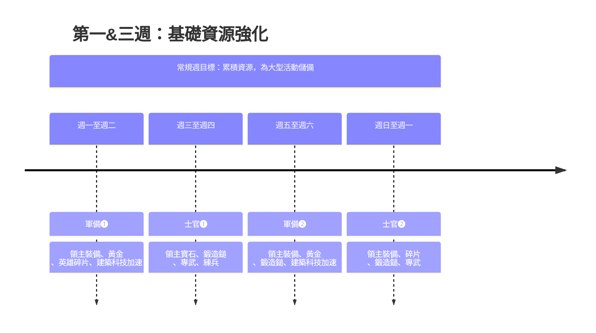
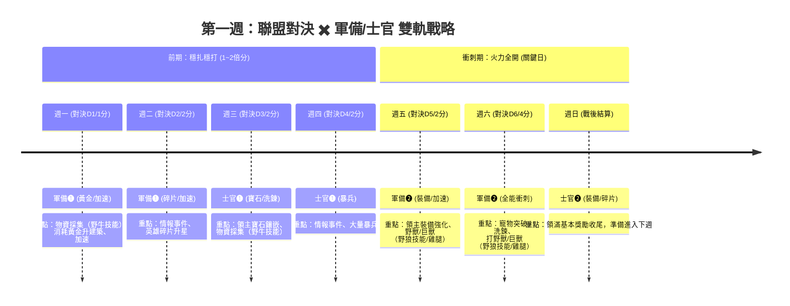
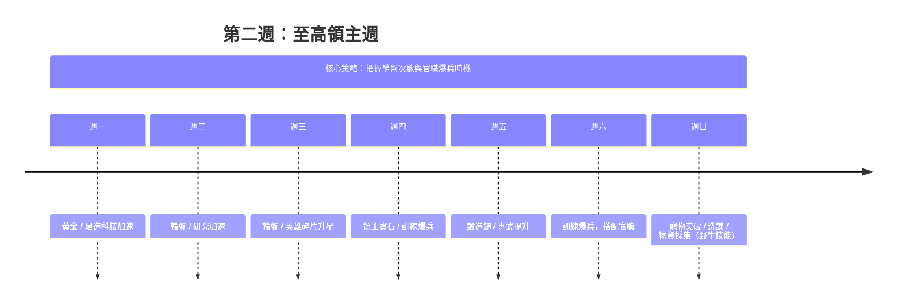
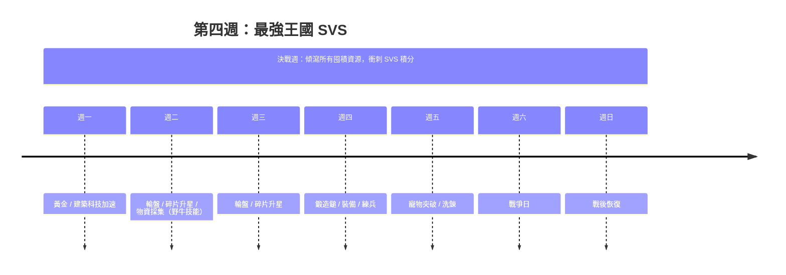

# Kingshot 零氪（F2P）完整攻略指南

> 整合中英文社群資源，涵蓋一代至五代英雄策略
> 當前進度 S4 初期
> 指南更新於 2026/05/02
>  **k1000** **NuB 聯盟** 35位以上**中文**玩家！
> 更多撇步與心得盡在**k1000** **NuB 聯盟**
> 聯盟結構 歡樂日常 



---

## 目錄

1. [一、英雄世代指南](#一英雄世代指南)
2. [二、零氪最佳策略](#二零氪最佳策略)
3. [三、陣容推薦與英雄排名](#三陣容推薦與英雄排名)
4. [四、寵物培養](#四寵物培養)
5. [五、大師培養](#五大師培養)
6. [六、資源管理](#六資源管理)
7. [七、秘境試煉各副本部隊比例推薦](#七-️-秘境試煉各副本部隊比例推薦)
8. [八、KingShot 四週循環戰略月曆](#八--kingshot-四週循環戰略月曆)
9. [九、常見錯誤（務必避免）](#九常見錯誤務必避免)
10. [十、針對你目前進度的具體建議](#十針對你目前進度的具體建議四代)
11. [十一、禮包購買建議](#十一禮包購買建議)

---

## 一、英雄世代指南

### 第一代英雄

| 英雄                                                                             | 兵種     | 評價        | 備註                                                      |
| -------------------------------------------------------------------------------- | -------- | ----------- | --------------------------------------------------------- |
| **阿瑪迪斯 Amadeus**                                                       | 步兵     | S級（集結） | 唯一進攻型步兵專武（命運之盾），提供乘法加成，可用5代以上 |
| **潔貝爾 Jabel**  | 騎兵     | S級（駐防） | Day 2 免費取得，最易滿星，專武（信仰護脛）必練            |
| **琴科 Chenko**   | 騎兵(SR) | A級（車身） | 第一遠征技能+25%致命性，全遊戲最強車身技能                |

### 第二代英雄

| 英雄                                                                             | 兵種 | 評價        | 備註                                                  |
| -------------------------------------------------------------------------------- | ---- | ----------- | ----------------------------------------------------- |
| **佐伊 Zoe**      | 步兵 | S級（駐防） | 英雄轉盤免費取得，HP<50%時自癒40%，零氪駐防首選至五代 |
| **希爾德 Hilde**  | 騎兵 | S級（車身） | 最強進攻遠征技+治療，沉默效果                         |
| **瑪琳 Marlin**   | 弓箭 | S級（集結） | 進攻專武（迷霧織者），頂級集結車頭                    |

### 第三代英雄

| 英雄                                                                             | 兵種 | 評價        | 備註                                                      |
| -------------------------------------------------------------------------------- | ---- | ----------- | --------------------------------------------------------- |
| **佩特拉 Petra**  | 騎兵 | S級（集結） | 首個騎兵集結專武（命運之書），最高爆發DPS（600%傷害潛力） |
| **耶格 Jaeger**                                                            | 弓箭 | A級         | 駐防強，+40%隊伍傷害BUFF                                  |
| **艾瑞克 Eric**                                                            | 步兵 | A級         | 防守專精                                                  |

### ★ 第四代英雄（你目前的進度）︰建議三隻全收入

| 英雄                                                                             | 兵種 | 評價        | 零氪建議                                       |
| -------------------------------------------------------------------------------- | ---- | ----------- | ---------------------------------------------- |
| **阿爾卡 Alcar**  | 步兵 | S級（駐防） | 「榮耀印記」全隊70%減傷2秒，駐防核心           |
| **羅莎 Rosa**     | 弓箭 | S級（集結） | 英雄轉盤可取得，完全免疫減益，四代最佳零氪投資 |
| **瑪歌 Margot**   | 騎兵 | S級（爆發） | 增加集結25%攻擊力（與雨音同等效果）            |

### 第五代英雄（伺服器200天+解鎖）︰競技場神英

| 英雄                    | 兵種 | 評價                | 備註                                                  |
| ----------------------- | ---- | ------------------- | ----------------------------------------------------- |
| **薇薇安 Vivian** | 弓箭 | **S級最優先** | 「臥虎」永久增加敵方受傷25%+50%雙倍傷害機率，攻防皆神 |
| **瑟魯德 Thrud**  | 騎兵 | S級                 | 「先祖指引」循環增加全隊傷害+減傷25%                  |
| **龍飛 Long Fei** | 步兵 | A級                 | 取代Amadeus的零氪步兵選擇，50%減傷機率                |

### 第六代英雄（最新）

| 英雄                                                                        | 兵種 | 評價             | 備註                                                                     |
| --------------------------------------------------------------------------- | ---- | ---------------- | ------------------------------------------------------------------------ |
| **陽 Yang**  | 弓箭 | **最優先** | 額外傷害+傷害增幅遠征技能，專屬裝備強化集結火力; 是 4 代 Rosa 的繼任者。 |
| **Triton**                                                            | -    | 待評估           | 資訊有限                                                                 |
| **Sophia**                                                            | -    | 待評估           | 資訊有限                                                                 |

---

## 二、零氪最佳策略

### 核心原則

1. **只專注培養3名核心英雄**，不要分散資源
2. **加入集結，不要帶頭** — 零氪戰力不足以當車頭
3. **寶石全投英雄轉盤（Hero Roulette）**，唯一例外是買第二建築隊列

### 零氪英雄培養路線

| 階段                         | 推薦陣容                     |
| ---------------------------- | ---------------------------- |
| 開荒期                       | Howard + Chenko + Quinn      |
| 二代已解鎖                   | Zoe + Marlin + Jabel         |
| 三代已解鎖                   | Zoe + Marlin + Petra         |
| **四代已解鎖（現在）** | **Zoe + Rosa + Petra** |
| 五代解鎖（預計6月）          | Long Fei + Rosa + Petra      |

### 零氪必練英雄（依優先度）

1. **Jabel** — 免費，最先滿星的傳奇英雄，平民駐守與競技場用。
2. **Zoe**  — 平民進攻步兵，即將在**英雄招募**中現身
3. **Chenko (SR)**  — 車身首位必選英雄，+25%殺傷力 ，性價比極高
4. **Rosa**  — 四代轉盤可得，免疫減益，專武技能增加全體殺傷力 
5. **Diana (SR)** 
   — 搭配 `荒野的試煉`活動取得，減少體力消耗 ，增加打怪出征速度 ，右排兩個技能必須點滿。
6. **Yeonwoo（SR）**  - 增加全體殺傷力 25%，加速科技研發速度 15% 。
7. **Amane（SR）**  - 增加全體攻擊力 25%，增加傷兵治療速度 50% 。
8. **Hilde(SSR)**  - 現階段唯一競技場奶媽（治療師），還有集結用 Buff（加攻擊力與防禦力）。即將在**英雄招募**中現身
9. **Margot（SSR）**  - 增加全體攻擊力 25% 。別人打熊只能出4隊去集結，有了 Margot 你的第五隊就能派出 Margot 去參與集結，能集結更多兵力打出更高傷害。

---

## 三、陣容推薦與英雄排名

### 各模式 Tier List

**集結（進攻）車頭：**

- Zoe + Petra  + Rosa /Marlin

**駐防（防守）車頭：**

- Jabel、Zoe、Hilde、Eric、Vivian、Long Fei、Saul

**車身（加入進攻集結）：**

- Chenko、Yeonwoo、Amane、Margot、Hilde、Margot

**車身（加入駐防）：**
步兵（60%）+騎兵（30-40%）+弓箭手（0-10%）

- 編隊 1 :Gordan  + any + any
- 編隊 2 :Hilde  + any + any

**獵熊車頭：**

- Zoe + Petra  + Rosa /Marlin

> Marlin 現階段若還沒投入，則**不建議投入**，僅剩下收藏與競技場價值！

**獵熊車身：**

- 編隊 1 :Chenko + any + any
- 編隊 2 :Yeonwoo + any + any
- 編隊 3: Amane + any + any
- 編隊 4: Margot  + any + any
- 編隊 5: Hilde  + any + any

### 最強集結組合

1. **Petra + Hilde + Rosa** — 測試高傷DPS
2. **Zoe + Petra + Hilde** — 最大存活力
3. **Alcar + Margot + Rosa** — 最佳駐防（減傷+閃避+免疫減益）

### 兵種比例建議

| 場景      | 步/騎/弓       | 說明                |
| --------- | -------------- | ------------------- |
| 集結進攻  | 5:2:3          | 50%步兵保護後排     |
| 駐防防守  | 6:2:2 或 7:3:0 | 重防守配置          |
| 獵熊/陷阱 | 1:1:8          | 80%弓箭手最大化輸出 |

[簡易版打熊計算機](https://tianyun233.github.io/troop-calculator-3.0/)

以下參數就你選好英雄後按圖片這兩處就能看見了，輸入後計算機會推薦你適合的兵力比例
純參考用

 

[進階版本計算機](https://frakinator.streamlit.app/)

### 打熊集結機制重點

- 車頭三位英雄的遠征技能**全數生效**
- 整個集結隊伍的基礎攻擊力與致命力（Lethality），全部看**車頭**的數值。車頭的裝備、科技、英雄星級決定了這班車能打多痛。
- 車身英雄僅取**技能等級最高的前四位**的「**遠征第一技能**」生效，請車頭檢視車身首位英雄是否正確。但車身自己的裝備、科技、攻擊力面板完全不重要，因為進了集結，就是套用車頭的面板。
- 所以 Chenko 的第一遠征技能（+25%致命性）要優先升級
- **裝備只在你當車頭時生效**，加入別人集結時你的裝備無效
- **專武提供乘法加成**，裝備提供加法加成 → 專武後期價值更高
- 不要只提供單一兵種。因為傷害與兵量**不是等比例成長**的（邊際效益遞減）。假設你派 10,000 個弓箭手能打出 100 萬傷害，那你派 40,000 個弓箭手（4 倍兵量）時，傷害不會變成 400 萬，而是只有 $\sqrt{4} = 2$ 倍，也就是 200 萬傷害。
- 兵種傷害基礎權重： 步兵乘數 $\frac{1}{3}$，騎兵是 $1$，而弓兵高達 $\frac{4}{3}$。這意味著在相同的隊長屬性下，弓兵能轉換出的基礎傷害量是最高的。=> 100%的兵力配筆下，弓箭手要最多，步兵要極少，騎兵則是填補弓箭手數量不足用。

---

## 四、寵物培養

- 灰郎︰建造加速，30級以前衝刺最佳幫手。建議突破至滿級，不需要洗練資源做培養。
- 山貓 ︰提供額外體力，建議突破至滿級，不需要洗練資源做培養。
- 野牛 ︰瞬間完成指定採集任務，建議突破至滿級能縮短 CD 時間，初期可以簡單洗練資源做培養至藍色階段。尤其在 KVK/聯盟對決/總動員任務時非常非常好用。
- 獵豹 ︰提供口糧，提升到開啟技能後不太建議太早做培養。
- 駝鹿 ︰打架神寵，有餘力可以突破與培養。
- 獅子 ︰隨機贈與領主材料，建議突破至滿級能縮短 CD 時間，洗練資源做培養至藍色階段。
- 灰熊 ︰增加攻擊力，打架神寵，建議突破至滿級，洗練資源做培養至藍色階段。
- 大野牛 ︰使小隊容量增加。集結神寵，建議突破至滿級！
- 大駝鹿 ︰使集會容量增加。
- 黑豹 ︰增加殺傷力，打架神寵，建議突破至滿級，洗練資源做培養至藍色階段。

## 五、大師培養

近期推出了大師學院的系統，跟寵物很相似，但全部都是被動技能。

- 維拉 Valora 
  - 狩獵本能（天生技能）︰增加打巨熊的傷害（僅對自己生效），也就是說如果你是車頭，這buff 只對你有效，車頭的大家不會被套用。如果你是車身，也是有用。
  - 狩獵之舞︰增加狩獵巨熊活動的集結容量（車頭必點技能），能讓聯盟更多玩家加入你的集結取得更高的狩獵傷害分數。
  - 經驗傳承︰參加巨熊活動後的獎勵可以額外得到裝備經驗零件。
  - **武器專精**︰參加巨熊活動後的獎勵可以額外得到鍛造鎚（F2P玩家必點！)
  - 人數優勢︰參加巨熊活動時可以提昇自己得出征人數，但如果聯盟有 `限制上車人數`則該技能無用。
- 潘 Pan 
  - 資源儲備（天生技能）︰每天重置，每累計採集 120 分鐘可以得到額外的儲備寶箱。儲備寶箱有機率取得**黃金**。
  - **獵鷹偵查**︰每天重置，可以額外發現更多情報事件。
  - **膳食管理**︰每天的 08:00 與 20:00 的體力補給會從 120 點體力變得更多。
  - 建築計畫︰縮短建造時間。
  - **特殊管道**︰每天重置，可以增加額外的神秘商店刷新次數以及可額外獲得神秘徽章。
- 羅曼 Roman 
  - 天生好鬥（天生技能）︰在競技場的每場戰鬥有機率額外獲得競技明星寶箱。競技明星寶箱有機率取得**鍛造鎚**。
  - 勇者無懼︰護衛（英雄旁的小兵們）可以獲取額外的攻擊力與生命值
  - **享受勝利**︰競技場的每日與每週結算提昇額外的競技幣。
  - **邁向榮耀**︰競技商店中可享有折扣以及多提供商品進行選購。
  - 萬眾矚目︰英雄在競技場中可以提昇攻擊力與生命值。

> 小弟自己大師徽記大部分都投資在 `潘`身上。另外兩隻只有先投資到 30 等點頭之交3，開啟第3技能。之後才會再回來投資在令兩隻大師身上。
> 潘的膳食管理，如果你是月卡玩家，可以完全忽略，畢竟你不缺體力值。但若是零課玩家建議多升該技能。
> 獵鷹偵查，我也是盡量點高，好處是KVK與聯盟對決你就有多幾次的情報任務積分，平時也能有多一個管道慢慢累積黃金。
> 特殊管道，我也是盡量點高，有更多機會刷到免費和50%折扣的專武碎片以及寵物高級洗練道具。

## 六、資源管理

### 建築優先級

城鎮中心 > 訓練營 > 學院 > 指揮中心 > 其他

- 診所、廚房、民房 → 升到10級即可停
- 資源建築 → 不需要升級
- 目標：衝**城鎮中心** 30級解鎖 T10 部隊

> 小撇步：先開啟灰狼技能（`建造加速`）與法令技能（`加速建造`），如果同時間有申請官職 `總理大臣`，最後在去進行建築物升級，可以大幅度縮短建造時間約 30%。

### 研究優先級

指揮戰術 > 訓練工具 > 建造速度 > 研究速度 > 採集 > 兵團擴展

### 裝備升級優先級

鍛造鎚與傳說裝備與秘銀的投資重點順序︰`弓箭手 > 步兵 > 騎兵`。

1. **最優先** 弓箭手致命性（頭盔/靴子），替自己在獵熊活動製造高分高傷，取得更多鍛造鎚。
2. 步兵生命值（胸甲/手套）
3. 騎兵殺傷力（頭盔/靴子）

> 原因：步兵優於騎兵的原因是步兵為全軍擋傷害，步兵活越久 = 弓騎輸出越多

### 鑽石使用優先級

1. 第二建築隊列（永久，重要的微課金投資100$）
2. 第五遠征隊列（永久，最重要的微課金投資100$），這兩個禮包任意一個購買後會伴隨開啟銀行的 `每日儲蓄`。
3. 英雄轉盤 — 所有其餘鑽石全投這裡
4. **不要花在**：加速、臨時建築隊列、外觀

### 日常任務清單

- 每12小時領取體力（08:00 與 20:00 各一次）
- 完成每日任務
- `流浪商店`購買 `VIP經驗值`、有折扣的加速道具。
- `神秘商店`（有免費道具和折扣）、50%的 `專武碎片`
- `競技商店`兌換 `傳說英雄裝備客製化箱子`
- `VIP商店`兌換 `領主體力（雞腿）`、高級傳送
- `聯盟商店`每日兌換、有折扣的加速道具與高級傳送道具，每週兌換 `寵物突破材料客製化箱子`。
- `爭霸賽商店`：**寵物獎牌**、**通用大師徽記**、**高級寵物洗練**
- `聖劍商店`：三英都收集、臨時需要領主裝備/寶石時
- `最強王國商店`︰黃金、黃碎
- `潮汐商店`︰高級洗練、寵物獎牌、臨時需要領主裝備/寶石時
- `挑戰試煉商店`︰秘銀、裝備箱、黃碎
- 參加聯盟活動、競技場、秘境試煉（兵種能預設 `50:20:30`）
- 保持建築和研究不間斷
- 活動基本獎勵都拿滿
- 每週領主裝備/領主寶石的 `強化材料兌換`

## 七 🛡️ 秘境試煉各副本部隊比例推薦

#### ⚔️ 角鬥賽場 & 輝光尖塔 (三隊配置)

| 隊伍           | 部隊比例 (步 / 騎 / 弓) | 英雄配置建議                                              |
| :------------- | :---------------------- | :-------------------------------------------------------- |
| **1 隊** | **60 / 40 / 00**  | 放置**最強步兵與騎兵英雄**，弓兵英雄不放或任意。    |
| **2 隊** | **50 / 10 / 40**  | 放置**最強弓兵英雄**，搭配第二梯隊的步兵/騎兵英雄。 |
| **3 隊** | **50 / 20 / 30**  | 放置剩餘實力**最強的英雄**。                        |

---

#### 🌲 其他資源副本配置

| 副本名稱           | 部隊比例 (步 / 騎 / 弓) |
| :----------------- | :---------------------- |
| **生命森林** | **50 / 15 / 35**  |
| **水晶礦洞** | **60 / 20 / 20**  |
|                    | **55 / 10 / 35**  |
| **知識樞紐** | **50 / 20 / 30**  |
|                    | **55 / 10 / 35**  |
| **熔岩要塞** | **60 / 15 / 25**  |
|                    | **55 / 10 / 35**  |

*(註：以上數據比例順序皆為 **步兵 / 騎兵 / 弓兵**)*

## 八 📅 KingShot 四週循環戰略月曆

KingShot 的活動遵循 28 天（4 週）的循環。本月曆幫助你跟蹤每日活動，提前規劃資源投入。



僅領滿**基本獎勵**即可。
**第一週重點：** 完成基礎資源累積，為後續大型活動做儲備。
**第三週重點：** 再次累積資源，為 SVS 決戰做準備。建議開始保留秘銀和高級印記。



**情報卡點技巧:**
聯盟對決的第二天與第四天都有「完成情報事件 (3000分)」。建議在前一天的晚上睡前(0點)，不要去完成任務甚至去擊殺任務對象，等過了換日線（早8後）再領，可以輕鬆白嫖分數。



**第二週重點：**

- 週二/三：重點輪盤盡量每天轉滿 `60 次`，兩天總計 120 次
- 週六：爆兵前記得申請官職加成

**兵力生產技巧:**
平時可以生產 **9 級兵種**（耗時時間相對短，可快速累積總兵力），等待至有活動計分寫著 `晉升士兵所得積分為xxx`的活動日時，該日請專注於**晉升 9 級兵至 10級兵**的動作，並搭配官職與訓練加速，快速累積活動積分。



**第四週重點：**

- **SVS-D2 & D3：**：重點輪盤盡量每天轉滿 `60 次`，兩天總計 120 次
- **SVS-D4 & D5：** 使用累積的秘銀、精煉黃金、英雄碎片、高級印記
- **SVS-D5（全能階段）：** 一天內可達成多項任務，最高分日
- **SVS-D6（戰爭日）：** 擊殺 T11 士兵或佔領太陽城
- 第四週末會跨越到下一個循環的第一週

---

## 循環提示

- **循環週期：** 每 28 天（4 週）重複一次
- **跨週活動：** 「士官計劃❷」通常會跨到隔週週一
- **資源預留：** 在第三週末開始減少日常消耗，為 SVS 做準備

### 進度參考基準

| 天數  | 主城等級 | 戰力    |
| ----- | -------- | ------- |
| 60天  | 22-24    | ~600萬  |
| 120天 | 26-28    | ~1800萬 |
| 150天 | 30       |         |

### 遊戲進度行事曆

| 開服天數       | 大事件              | 核心變化                           |
| -------------- | ------------------- | ---------------------------------- |
| 220天          | 🏛️ 戰爭學院解鎖   | 解鎖 T11 兵種科技。                |
| 第 270 天      | ⚔️ 第五代英雄降臨 | 輪盤步兵龍飛、美女槍手 Vivian      |
| 第 280 天      | 🐾 第五代寵物登場   | 大駝鹿（集結容量）、黑豹（殺傷力） |
| 第 315～320 天 | 黃金 8 級           | 建築等級上限擴充至 FC8。           |

---

## 九、常見錯誤（務必避免）

1. **英雄投資過於分散** — 只練3個核心英雄，一個一個練滿再換下一個
2. **技能點平均分配** — 集中點一條技能樹
3. **建築工人閒置** — 每一秒閒置都是浪費
4. **跳過活動** — Hall of Governors 等活動獎勵巨大，加速道具和資源要留到活動期間使用
5. **忽視神秘商店** — 每日多次刷新有免費物品
6. **沒有儘早加入強力聯盟** — 開服2天內就要加入活躍聯盟
7. **過早花鑽石** — 只用於英雄轉盤
8. **同時使用緊急動員和急工** — 這兩個不疊加，同時用等於浪費
9. **忽視主城升級** — 主城等級決定所有建築上限
10. **忽視藍色英雄** — 藍色英雄用於採集仍有價值
11. **老英雄滿專武 > 新英雄低投資** — 不要太快放棄已培養的英雄
12. **F2P 建議** 專注 `領主裝備`、`領主寶石`、`寵物培養`大過於英雄專武。因為英雄會兩個多月就出新的，後面的英雄基礎屬性會碾壓之前世代的英雄，會導致疲於更換以培養的英雄。
13. **戰爭學院的兌換** — 應僅使用 `金幣`來兌換 `金沙`，而不應使用 `黃金`來兌換成金沙。黃金是重要的升級道具，金幣對我們來說則不那麼重要。

---

## 十、針對你目前進度的具體建議（四代）

### 立即行動

1. **累積鑽石**
2. 維持 **Zoe + Petra + Rosa** 為核心組合

### 為五代做準備

1. 存寶石 → 五代開放後第一時間抽 ***Long Fei**
2. **Long Fei** 可作為零氪步兵替換 Zoe
3. 又或者放棄五代的培養，為六代提早累積鑽石。

### 為六代做準備

1. **Yang** 是六代最優先培養目標
2. 持續累積資源，不要在四代末期過度投入

### 你的目標陣容演進

```
一代：Jabel + Saul 
  ↓
二代：Zoe + Marlin + Jabel
  ↓
三代：Zoe + Marlin + Petra
  ↓
現在（四代）：Zoe + Rosa + Petra
  ↓
五代開放：Long Fei + Rosa + Petra（集結）/ Vivian 任何隊伍
  ↓
六代開放：Yang + 最佳搭配（待社群驗證）
```

> 指南更新於 2026/04/01
>  **k1000** **NuB 聯盟** 35位以上**中文**玩家！
> 更多撇步與心得盡在**k1000** **NuB 聯盟**
> 聯盟結構 歡樂日常 

---

## 十一、禮包購買建議

- 首選**隊列禮包**，終身只要花費 `100$`，開啟第五個隊列以及開啟銀行的每日活存。**CP 值王者**。
- 次選**超值月卡**，`每月花費 330$`，開啟第六個隊列，以及總計 14,000 顆鑽石與 600 個體力雞腿。最重要的是能啟用 `自動狩獵功能`，在 `聯盟對決活動`的最後兩天能解放你的雙手與時間。
- 次選**登入好禮**，`每週花費 33$`，能拿到 10 個黃金，等於一個黃金 `3.3$`。還能獲得黃色通用碎片、領主材料等各兩份，以及各種加速道具一小時各一份。都是 KVK 備戰階段所需的高分道具。

如果每個月購買上述兩種月費禮包，總花費則是 `每月 462$`。

### 黃金

當黃金 5 時代與戰爭學院開啟，`黃金`變成是戰力級距的重要關鍵。

| 禮包               | 費用                                                 | 黃金數量  | 每顆單價 | 評價 |
| ------------------ | ---------------------------------------------------- | --------- | -------- | ---- |
| **黃金周卡** | 170$/週 | 94 顆 + 7 個寶箱（保底 129 顆） | ~1.32$ | ⭐ 最推薦 |          |      |
| **隨心寶箱** | 170$（四週一次） | 66 顆 | ~2.58$                  | 次推薦    |          |      |
| 黃金超值禮包       | 170$ | 40 顆 | ~4.25$                              | 不推薦    |          |      |
| 黃金提煉計畫       | 170$ | 30 顆 + 1 個寶箱（保底 35 顆） | ~4.85$     | 不推薦    |          |      |

> 小總結：黃金 CP 值，**周卡 > 隨心寶箱 > 登入好禮 > others**。

如果選配 `黃金周卡`，則等於每月 462$ 加上四次周卡，`每月約 1,142$`。周卡已是小課的範疇，每月消費來到四位數。 如果再購買黃金隨心禮包，則一個月共計 `1,312$`。這樣的禮包搭配能讓我們不會有太多負擔，又能保持一定的黃金資源來維持戰力，提供優質的遊戲體驗。

---

## 資料來源

### 英文來源

- [KingshotGuides - F2P Guide](https://kingshotguides.com/guide/complete-f2p-and-low-spender-guide-for-kingshot/)
- [KingshotGuides - Hero Tier List](https://kingshotguides.com/guide/the-only-kingshot-hero-tier-list-you-actually-need/)
- [AllClash - Best Heroes Tier List](https://www.allclash.com/best-heroes-in-kingshot-tier-list/)
- [Pocket Gamer - Tier List March 2026](https://www.pocketgamer.com/kingshot/tier-list/)
- [LDShop - Gen 5 Tier List](https://www.ldshop.gg/blog/kingshot/hero-tier-list.html)
- [BlueStacks - Tips &amp; Tricks](https://www.bluestacks.com/blog/game-guides/kingshot/kgst-tips-tricks-en.html)

### 中文來源

- [帝國代儲 - 無課&amp;課金推薦角色全攻略](https://diguogames88.com/kingshot%E6%94%BB%E7%95%A5/)
- [精靈遊戲 - 角色選擇全攻略](https://elfgames24h.pixnet.net/blog/posts/16188368141)
- [巴哈姆特 - 新手必練角色+隊伍搭配](https://forum.gamer.com.tw/C.php?bsn=82382&snA=8)
- [JISU極速 - 集結與駐防戰術](https://jisu.tw/kingshot-%E9%9B%86%E7%B5%90%E8%88%87%E9%A7%90%E9%98%B2%E6%88%B0%E8%A1%93/)
- [LootBar - 英雄裝備指南](https://lootbar.gg/blog/zh-Hant/kingshot-hero-gear-guide-best-upgrade-priorities-and-tips.html)
- [Altema - 各世代英雄育成優先度](https://altema.jp/kingshot/ikuseiyuusendo)

### Wiki 資源

- [Kingshot Fandom Wiki](https://kingshot.fandom.com/wiki/Kingshot)
- [Kingshot Wiki](https://kingshotwiki.com/)
- [Kingshot Database](https://kingshotdata.com/)
